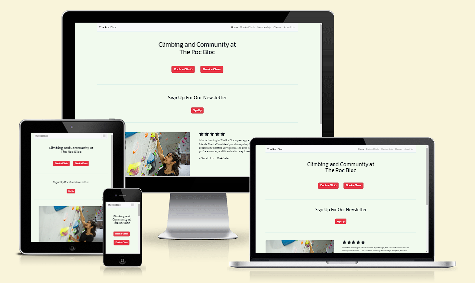
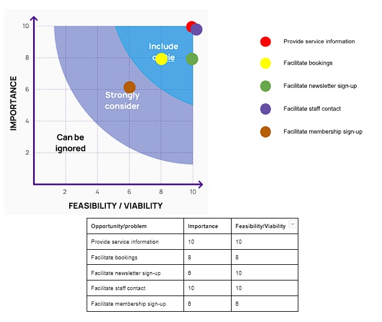
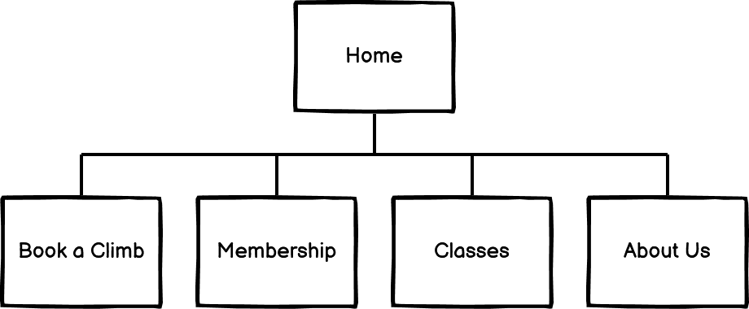
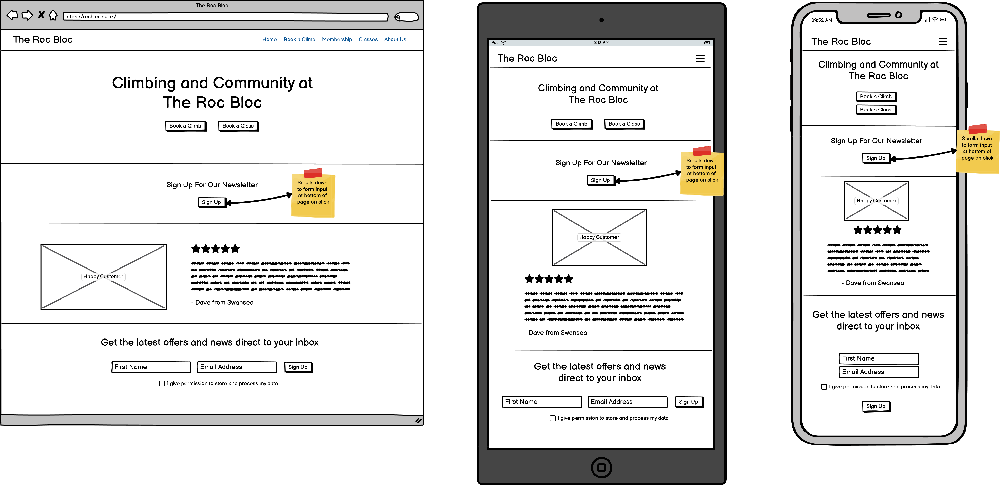
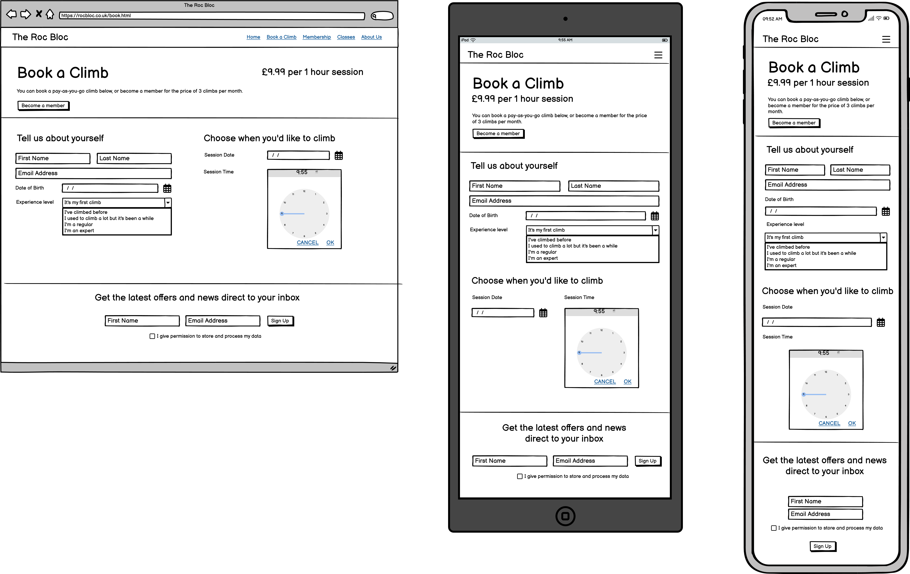
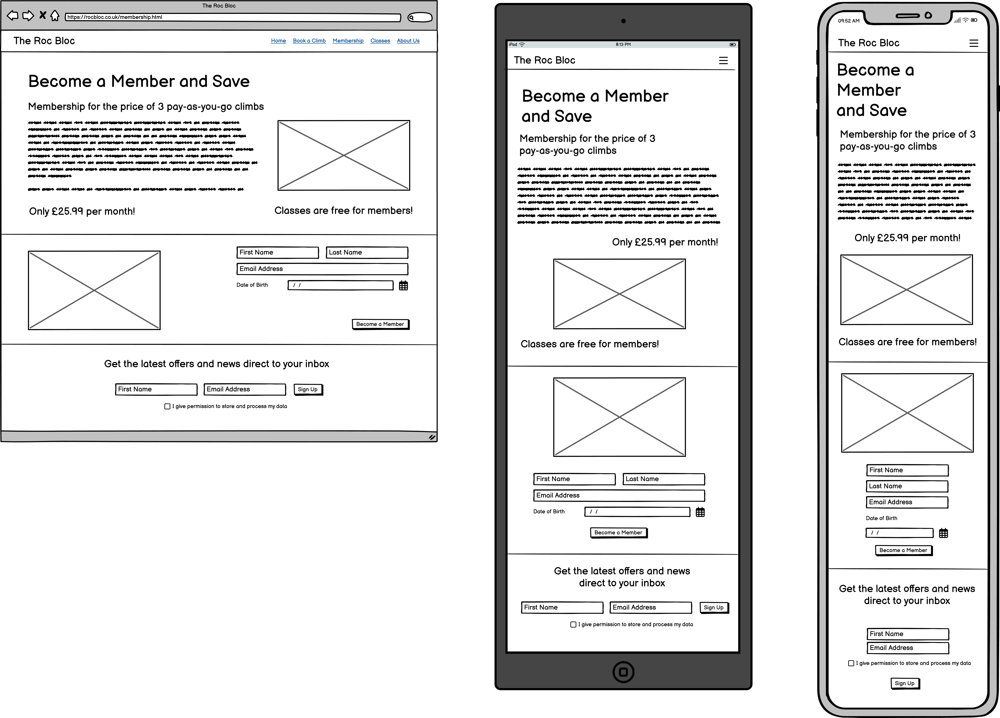
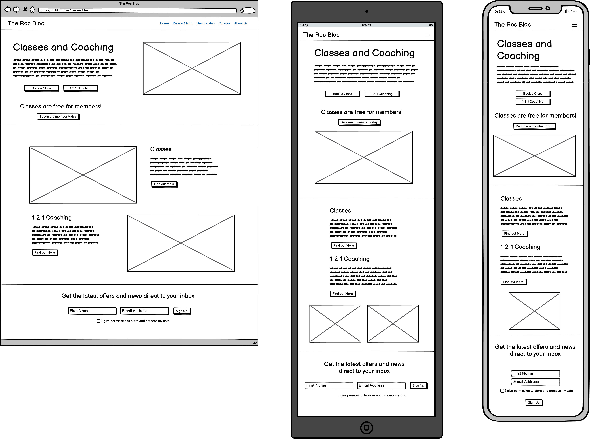
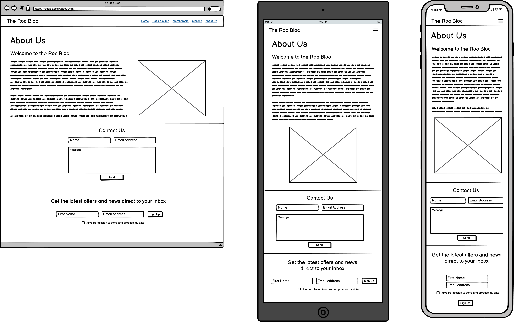

# Roc Bloc

## Table of Contents

1. [UX](#ux)

   - [Ideal User Demographic](#ideal-user-demographic)
   - [Project Goals](#project-goals)
   - [Business Goals](#business-goals)
   - [User Stories](#user-stories)
   - [Development Planes](#development-planes)

2. [Design](#design)

   - [Structure](#structure)
   - [Colour Palette](#colour-palette)
   - [Fonts](#fonts)
   - [Imagery](#imagery)

3. [Features](#features)

   - [Design Features](#design-features)
   - [Features Yet To Be Implemented](#features-to-implement)

4. [Tecnhologies Used](#technologies-used)

   - [Languages Used](#languages-used)
   - [Frameworks, Libraries & Programs Used](#frameworks-used)

5. [Testing](#testing)

   - [TESTING.md](TESTING.md)

6. [Deployment](#deployment)

## UX

### Ideal User Demographic

The ideal user for this website is:

- A new customer
- A current customer

### Project Goals

The site's users are gym members and potential members, who want to know more about the gym and its procedures.

### Business Goals

The gym is interested in attracting and retaining members.

### User Stories

As a new or current user I want:

1. To see what services the business offers
2. To book and pay for the services offered
3. To to stay up to date with changes to the business's offerings
4. To contact a member of the business team

As a business I want:

1. To showcase the business's offerings
2. To allow customers to book and pay for the services offered
3. To allow customers to sign up to our mailing list
4. To provide a point of contact for customers

### Development Planes

#### Strategy

Strategy incorporates user needs as well as product objectives. This website will focus on the following target audience, divided into three main categories:

- Roles:
  - Current users
  - New users
- Demographic:
  - All ages
  - UK residents
  - Beginner to experienced climbers
- Psychographic:
  - Lifestyles:
    - Active
  - Personality/Attitudes:
    - Outgoing
  - Values:
    - Sense of community

The websites needs to enable the user to:

- See information about services offered:
  - Pay-as-you-go climbing sessions
  - Membership
  - Classes
  - Coaching
- Book a climbing session
- Sign up for the newsletter
- Contact a member of staff

The website needs to enable the site manager to:

- Gather information about booked climbing sessions
- Gather information about membership requests
- Gather information about newsletter sign-up requests
- Gather information about contact requests

#### Scope

The scope plane is about defining requirements based on the goals established on the strategy plane. Using the information in the strategy plane, the identified required features have been broken into the following two categories.

- Content requirements:
  - The user will be looking for:
    - Prices for climbing
    - Prices for membership
    - Information about the company
    - Information about classes
    - Information about coaching
- Functionality requirements:
  - The user will be able to:
    - Request membership
    - Book a pay-as-you-go climb
    - Contact a member of staff
    - Sign up for the newsletter

#### Structure

The information above was then organized in a hierarchical tree structure, a site map, showing how users can navigate through the site with ease and efficiency, with the following results:

#### Skeleton

Wireframes were made to showcase the appearance of the site pages while keeping a positive user experience in mind. The wireframes were created using a desktop version of Balsamiq.

##### Home

##### Book a Climb

##### Membership

##### Classes

##### About Us

## Design

### Structure

Overall website structure and design was inspired by https://www.theclimbinghangar.com/

### Colour Palette

[This colour palette](https://coolors.co/palette/e63946-f1faee-a8dadc-457b9d-1d3557) was chosen for its strong red and selection of contrasting blues.

### Fonts

The entire website uses the [Kanit regular 400](https://fonts.google.com/specimen/Kanit) font from Google Fonts

### Imagery

### sarah.jpeg

Image from https://www.thebmc.co.uk/indoor-bouldering-the-lowdown under the Creative Commons Licence.

### group.jpeg

Image from https://www.pexels.com/photo/group-climbers-posing-together-7591300 under the Creative Commons Licence.

### climber.jpg

Image from https://www.shutterstock.com/image-photo/climber-boulder-gym-man-climbing-bouldering-1474754396 downloaded from Shutterstock under licence.

### father-daughter.jpg

Image from https://www.shutterstock.com/image-photo/father-his-daughter-rock-climbers-training-2175434795 downloaded from Shutterstock under licence.

### class.jpg

Image from https://www.shutterstock.com/image-photo/children-climbing-gym-1170325528 downloaded from Shutterstock under licence.

### coach.jpg

Image from https://www.shutterstock.com/image-photo/rock-climbers-climbing-gym-young-woman-1147315010 downloaded from Shutterstock under licence.

### climber2.jpg

Image from https://www.shutterstock.com/image-photo/couple-athletes-climber-moving-on-steep-1640478094 downloaded from Shutterstock under licence.

### favicon.png

Image from https://icons8.com/icons/set/bouldering under licence https://intercom.help/icons8-7fb7577e8170/en/articles/5534926-universal-multimedia-license-agreement-for-icons8

## Features

### Design Features

Each page within the site has a consistent and responsive navigation system. The details of features on the site are detailed below.

- There is a navigation bar at the top of the page. It collapses to a hamburger menu on tablet- and mobile-sized screens. When clicked or tapped it opens a dropdown menu which shows the navigation options.
- Each page consists of a number of sections arrayed vertically with a visual separator between them. Content within sections rearranges to suit the available screen width.
- Each page has a section in common at the bottom of the page. This contains the newsletter sign-up form. The form displays as an inline form on wide screens but stacks vertically on smaller screens.

#### Home

The home page consists of the following sections:

- _Welcome text_ - This section provides a simple statement of the name of the company and what it offers. It also has two call-to-action buttons, one for booking a climb and one for booking a class.
- _Sign-up CTA_ - A call-to-action button which scrolls the page to the newsletter sign-up form at the bottom of the page.
- _Customer testimonial_ - A customer testimonial giving their positive opinion of the company's services.

#### Book a Climb

The booking page consists of the following sections:

- _Header_ - This section briefly indicates the purpose of the page and gives the price of a climbing session. It also contains a call-to-action button that invites the user to become a member; it takes the user to the membership page. The two headers at the top of this section are displayed on the same line on wide screens but stack vertically on smaller screens.
- _Booking form_ - The booking form contains two parts that are arranged in two columns on wide screens and in one column on narrower screens. The first part is to collect information about the user including name, email address, date of birth and level of climbing experience. The second part is for the user to input their desired session date and time.

#### Membership

The membership page consists of the following sections:

- _Header_ - This section breifly describes the price and features of membership. It displays in two columns on wide screens or one column on narrow screens.
- _Membership form_ - This section contains a form which allows a user to enter their personal details to become a member and an image for decoration. The image and form display in two columns on wide screens but stack vertically on narrower screens. On very narrow screens the controls of the form itself will stack vertically.

#### Classes

The classes page consists of the following sections:

- _Header_ - This section briefly describes the classes and coaching offered by the company. It also contains three call-to-action buttons: One scrolls the page down to the section describing classes; another scrolls the page down to the section describing 1-2-1 coaching; and the third takes the user to the membership page. There is also an image for decoration. The image and the information display in two columns on wide screens but stack vertically on narrower screens. On very narrow screens the buttons in the information section stack vertically.
- _Classes and coaching information_ - This section briefly describes the classes and coaching on offer and gives the user buttons to take them to further information. This further information is not yet implemented due to time constraints. The decoration images are displayed at the bottom of this section on narrow screens, and one image will be omitted on very narrow screens.

#### About Us

The about page consists of the following sections:

- _Header_ - This section provides some information about the company and people behind it. It also contains an image for decoration. The image and text display in two columns on wide screens but stack vertically on narrow screens.
- _Contact form_ - This section contains a form allowing a user to send a message to the company's staff. The form's controls display in two columns on wide screens and one column on narrow screens.
- _Media attribution_ - This section displays attribution for media used in the website to comply with the usage terms of the media's licence agreement.

### Features Yet To Be Implemented

Below is a list of features that are not currently implemented due to time constraints.

- Booking form
  - Don't allow the user to select dates and times in the past
  - Don't allow the user to select dates and times that are already booked
- Classes and coaching
  - Implement pages for further information on classes and coaching
  - Implement forms to allow the user to sign up for classes and coaching

## Technologies Used

### Languages Used

- HTML5
- CSS3

### Frameworks, Libraries & Programs Used

- [Google Fonts](https://fonts.google.com/)
  - Google Fonts was used to provide the Kanit font used in the website
- [Bootstrap](https://getbootstrap.com/)
  - Bootstrap 5.2.3 was used to provide styling and structural classes to the website
- [Bootstrap Icons](https://icons.getbootstrap.com/)
  - Bootstrap icons 1.10.5 was used to provide icons
- [GitHub](https://github.com/)
  - GitHub was used to store the project after pushing
- [Codeanywhere](https://codeanywhere.com/)
  - Codeanywhere was used for writing code, committing, and then pushing to GitHub
- [Balsamiq](https://balsamiq.com/)
  - Balsamiq was used to create the wireframes during the design phase of the project
- [Am I Responsive?](https://ui.dev/amiresponsive)
  - Am I Responsive was used in order to see responsive design throughout the process and to generate mockup imagery to be used
- [Shutterstock](https://www.shutterstock.com/)
  - Shutterstock was used to provide imagery for the website
- [Icons8](https://icons8.com/)
  - The website's favicon was provided by Icons8

## Testing

See the [testing file](TESTING.md) for testing information.

## Deployment

This project was developed using the [Codeanywhere IDE](https://app.codeanywhere.com/), commited to git and pushed to GitHub using the built in function within Codeanywhere.

To deploy this page to GitHub Pages from its [GitHub repository](https://github.com/DavidMorgan92/rocbloc) the following steps were taken:

1. Log into GitHub
2. From the list of repositories on the screen, select **DavidMorgan92/rocbloc**
3. From the menu items near the top of the page, select **Settings**
4. Select the **Pages** section
5. Under **Branch** click the drop-down menu labelled **None** and select **main** and click **Save**
6. Upon clicking **Save** the page is automatically refreshed and the website is now deployed
7. Go back to the main page of the repository
8. On the right, under **Environments**, an environment called **github-pages** should appear as active
9. Click this link and then click **View deployment** to see the website
