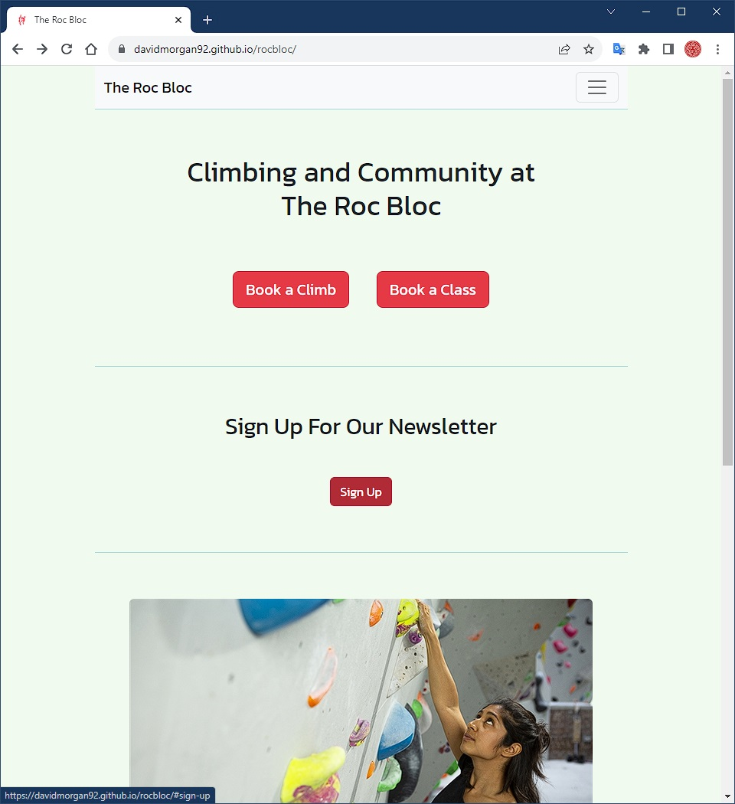

# Testing

## Table of Contents

1. [Testing User Stories](#testing-user-stories)
2. [Manual Testing](#manual-testing)

   - [Home](#home)
   - [Book a Climb](#book)
   - [Membership](#membership)
   - [Classes](#classes)
   - [About Us](#about)

3. [Automated Testing](#automated-testing)

   - [Lighthouse Scores](#lighthouse-scores)
   - [Code Validation](#code-validation)

## Testing User Stories

As a new or current user I want:

1. To see what services the business offers

   - Pay-as-you-go climbs are advertised on the booking page and the price is given.
   - Membership is advertised on the membership page and the price is given.
   - Classes and coaching are advertised on the booking page.

2. To book and pay for the services offered

   - There is a booking form on the booking page.
   - There is currently no way to pay through the website. This is a feature that can be added later.

3. To stay up to date with changes to the business's offerings

   - A newsletter sign-up form is shown on every page.

4. To contact a member of the business team

   - There is a contact form on the about page.

As a business I want:

1. To showcase the business's offerings

   - Pay-as-you-go climbs, membership, and classes and coaching are advertised on the website.

2. To allow customers to book and pay for the services offered

   - There is a booking form for pay-as-you-go climbs.
   - There is a sign-up form for membership.
   - There is currently no way to pay through the website. This is a feature that can be added later.

3. To allow customers to sign up to our mailing list

   - There is a newsletter sign-up form on every page.

4. To provide a point of contact for customers

   - There is a contact form on the about page.

## Manual Testing

<a name="#home">

### Home

- The navbar _Home_ link navigates to the home page
  - Before action:
    
  - After action:
    
- The navbar _Book a Climb_ link navigates to the booking page
  - Before action:
    
  - After action:
    
- The navbar _Membership_ link navigates to the membership page
  - Before action:
    
  - After action:
    
- The navbar _Classes_ link navigates to the classes page
  - Before action:
    
  - After action:
    
- The navbar _About Us_ link navigates to the about page
  - Before action:
    
  - After action:
    
- The _Book a Climb_ button navigates to the booking page
  - Before action:
    
  - After action:
    
- The _Book a Class_ button navigates to the classes page
  - Before action:
    
  - After action:
    
- The _Sign Up_ button scrolls the page to the sign up form
  - Before action:
    
  - After action:
    
- The _Sign Up_ form submits to the Code Institute form dump page
  - Before action:
    
  - After action:
    
- Responsiveness
  - 320px:
    
  - 768px:
    
  - 1024px:
    

<a name="#book">

### Book a Climb

- The navbar _Home_ link navigates to the home page
  - Before action:
    
  - After action:
    
- The navbar _Book a Climb_ link navigates to the booking page
  - Before action:
    
  - After action:
    
- The navbar _Membership_ link navigates to the membership page
  - Before action:
    
  - After action:
    
- The navbar _Classes_ link navigates to the classes page
  - Before action:
    
  - After action:
    
- The navbar _About Us_ link navigates to the about page
  - Before action:
    
  - After action:
    
- The _Become a Member_ button navigates to the membership page
  - Before action:
    
  - After action:
    
- The _Book Now_ form submits to the Code Institute form dump page
  - Before action:
    
  - After action:
    
- The _Sign Up_ form submits to the Code Institute form dump page
  - Before action:
    
  - After action:
    
- Responsiveness
  - 320px:
    
  - 768px:
    
  - 1024px:
    

<a name="#membership">

### Membership

- The navbar _Home_ link navigates to the home page
  - Before action:
    
  - After action:
    
- The navbar _Book a Climb_ link navigates to the booking page
  - Before action:
    
  - After action:
    
- The navbar _Membership_ link navigates to the membership page
  - Before action:
    
  - After action:
    
- The navbar _Classes_ link navigates to the classes page
  - Before action:
    
  - After action:
    
- The navbar _About Us_ link navigates to the about page
  - Before action:
    
  - After action:
    
- The _Become a Member_ form submits to the Code Institute form dump page
  - Before action:
    
  - After action:
    
- The _Sign Up_ form submits to the Code Institute form dump page
  - Before action:
    
  - After action:
    
- Responsiveness
  - 320px:
    
  - 768px:
    
  - 1024px:
    

<a name="#classes">

### Classes

- The navbar _Home_ link navigates to the home page
- The navbar _Book a Climb_ link navigates to the booking page
- The navbar _Membership_ link navigates to the membership page
- The navbar _Classes_ link navigates to the classes page
- The navbar _About Us_ link navigates to the about page
- The _Book a Class_ button scrolls down to the _Classes_ header
- The _1-2-1 Coaching_ button scrolls down to the _1-2-1 Coaching_ header
- The first _Find out More_ button scrolls to the top of the page
- The second _Find out More_ button scrolls to the top of the page
- The _Sign Up_ form submits to the Code Institute form dump page
- Responsiveness

<a name="#about">

### About Us

- The navbar _Home_ link navigates to the home page
- The navbar _Book a Climb_ link navigates to the booking page
- The navbar _Membership_ link navigates to the membership page
- The navbar _Classes_ link navigates to the classes page
- The navbar _About Us_ link navigates to the about page
- The _Contact Us_ form submits to the Code Institute form dump page
- The _Sign Up_ form submits to the Code Institute form dump page
- Responsiveness

## Automated Testing

### Lighthouse Scores

- [Home](documentation/lighthouse/index.pdf)
- [Book](documentation/lighthouse/book.pdf)
- [Membership](documentation/lighthouse/membership.pdf)
- [Classes](documentation/lighthouse/classes.pdf)
- [About](documentation/lighthouse/about.pdf)

### Code Validation

The [W3C HTML validator](https://validator.w3.org/) was used to validate the HTML.
The [W3C CSS validator](https://jigsaw.w3.org/css-validator/) was used to validate the CSS.

- [styles.css](documentation/validation/styles.css.pdf)
- [index.html](documentation/validation/index.html.pdf)
- [book.html](documentation/validation/book.html.pdf)
- [classes.html](documentation/validation/classes.html.pdf)
- [membership.html](documentation/validation/membership.html.pdf)
- [about.html](documentation/validation/about.html.pdf)
